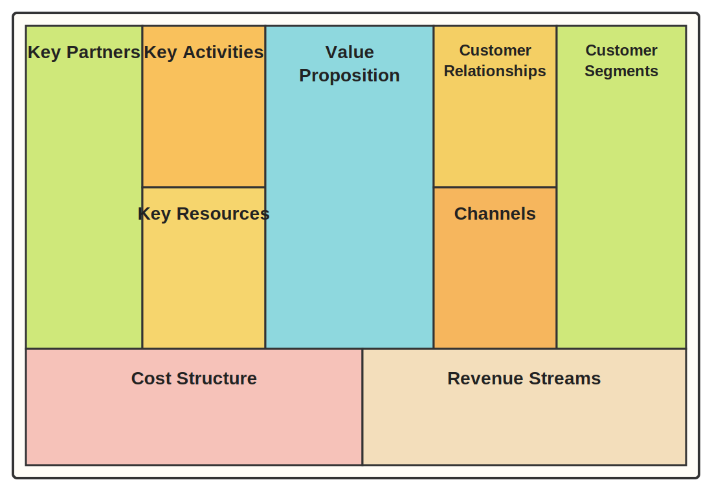

# Describe the Business Model Canvas. What segments are included in the canvas?

The **Business Model Canvas (BMC)** is a **one-page visual tool** for describing a business model. It gives a **high-level overview of the key building blocks** of a business and helps explain **how value is created, delivered, and captured**.

## Canvas overview

Because the **BMC uses spanning rows and columns**, a normal Markdown table cannot represent its layout correctly. The canvas is shown below as a diagram.

Visually, the canvas can be read as: **left = infrastructure** (`Key Partners`, `Key Activities`, `Key Resources`), **center = value proposition**, **right = customer side** (`Customer Relationships`, `Channels`, `Customer Segments`), and **bottom = finances** (`Cost Structure`, `Revenue Streams`).

## The 9 segments

| Segment | Meaning |
| --- | --- |
| **Customer Segments** | The groups of customers the company wants to serve. |
| **Value Proposition** | The value offered to customers; the problem solved or need satisfied. |
| **Channels** | How the company reaches customers and communicates with them. |
| **Customer Relationships** | The kind of relationship the company builds and maintains with customers. |
| **Revenue Streams** | How the business earns money from each customer segment. |
| **Key Resources** | The most important assets needed to create and deliver the value proposition. |
| **Key Activities** | The main things the business must do to operate successfully. |
| **Key Partnerships** | Important suppliers, partners, and external actors that support the business. |
| **Cost Structure** | The main costs involved in operating the business model. |

## Useful grouping from the course

- **Feasibility**: Key Partners, Key Activities, Key Resources
- **Desirability**: Value Proposition, Channels, Customer Relationships, Customer Segments
- **Viability**: Cost Structure, Revenue Streams

For an exam answer, it is usually enough to say that the BMC is a **structured one-page framework with nine building blocks** used to describe how a business works and how it creates, delivers, and captures value.
